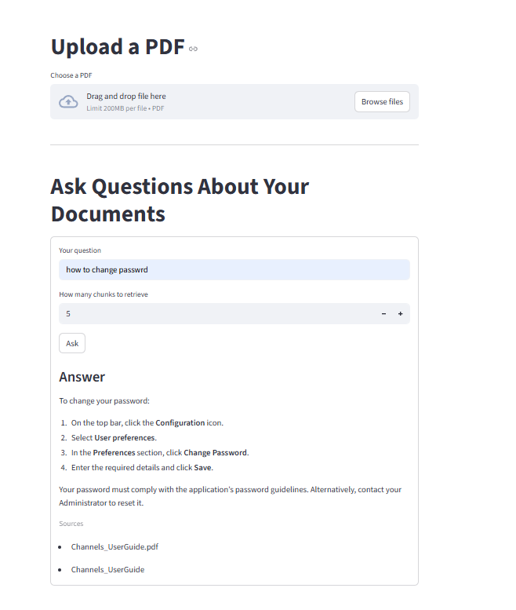

# doc-qa-rag-assistant

Conversational Q&A over PDF, Word and text documents. Upload documents, ask questions in a chat, and get grounded answers with numbered citations that point to the exact document and page.

Built with FastAPI, Inngest, Qdrant, OpenAI and Streamlit, with hybrid (semantic + keyword) retrieval, optional LLM re-ranking, follow-up questions, an evaluation set, tests and CI.

> **Origin.** This project started from Tech With Tim's
> [ProductionGradeRAGPythonApp](https://github.com/techwithtim/ProductionGradeRAGPythonApp) tutorial,
> which provided the basic structure: PDF ingestion and question answering as Inngest functions,
> Qdrant storage and a simple Streamlit page. I have since rebuilt and extended it with the features
> listed under [What I added](#what-i-added).

## Features

- **Multiple formats:** PDF, Word (`.docx`), `.txt` and Markdown
- **Page-level citations:** answers cite passages like `[1]`, and each citation shows the document, page and a snippet
- **Hybrid retrieval:** semantic vector search combined with BM25 keyword search using Reciprocal Rank Fusion, so exact terms like error codes and model numbers are found reliably
- **Optional LLM re-ranking** of retrieved passages
- **Chat with follow-up questions:** follow-ups are rewritten into standalone questions using the conversation history
- **Document management:** list indexed documents, delete them, and re-ingest without leaving stale chunks behind
- **Event-driven workflows** with Inngest: retries, throttling and debouncing of duplicate uploads
- **Evaluation:** a labelled question set with hit@k and MRR metrics, plus optional answer checking
- **Tests and CI:** pytest suite and an offline evaluation run on every push via GitHub Actions
- **Docker Compose** for the full stack (API, Inngest, Qdrant, UI)

## What I added

| Area | Tutorial | This project |
|---|---|---|
| File types | PDF only | PDF, Word, TXT, Markdown |
| Retrieval | Vector search | Hybrid vector + BM25 with rank fusion, optional LLM re-ranking |
| Answers | Plain answer + file names | Numbered citations with document, page and snippet |
| Conversation | Single question | Chat with history and follow-up rewriting |
| Documents | Ingest only | List, delete and cleanly re-ingest documents |
| Configuration | Hard-coded values | Central `config.py` driven by environment variables |
| Storage | Qdrant server | Local on-disk Qdrant by default, server via `QDRANT_URL` |
| Batch ingestion | – | `ingest_all.py` for a whole folder |
| Quality | – | Evaluation set and metrics (`eval/`) |
| Testing | – | pytest suite (`tests/`) and GitHub Actions CI |
| Deployment | – | Dockerfile and Docker Compose |

## How it works

1. **Ingest:** a document is loaded page by page, split into chunks and embedded with OpenAI. Old chunks of the same document are removed first, then the new chunks are stored in Qdrant with their source and page number.
2. **Condense:** if there is chat history, the latest message is rewritten into a standalone question.
3. **Retrieve:** the question is searched in two ways, by vector similarity and by BM25 keywords, and the two rankings are merged with Reciprocal Rank Fusion. Optionally an LLM re-ranks the candidates.
4. **Answer:** the top passages are sent to the model as numbered context. The model answers using only that context and cites passages like `[1]`. The cited passages are returned as citations.

Each step runs inside an Inngest function, which gives retries and visibility of every run in the Inngest dashboard.

## Evaluation

`eval/` contains sample documents and 15 labelled questions. The script measures how often the right passage is retrieved (hit@k) and how high it ranks (MRR), comparing dense-only and hybrid retrieval.

Result of the offline run used in CI (simple hashing embedder, no API key, k = 3):

| Retrieval | hit@3 | MRR |
|---|---|---|
| Dense only | 87% | 0.73 |
| Hybrid | 100% | 0.87 |

```bash
uv run python eval/run_eval.py --offline   # no API key needed
uv run python eval/run_eval.py             # with OpenAI embeddings
uv run python eval/run_eval.py --answers   # also generate and check answers
```

## Tech stack

- Python 3.13, `uv`
- FastAPI + Uvicorn
- Inngest (event-driven workflows)
- LlamaIndex (PDF reading and sentence splitting), docx2txt
- Qdrant (vector database)
- rank-bm25 (keyword search)
- OpenAI (embeddings and answers)
- Streamlit (chat UI)
- pytest, GitHub Actions, Docker

## Project structure

| Path | Purpose |
|---|---|
| `main.py` | FastAPI app and Inngest functions: ingest, delete, query |
| `config.py` | Settings from environment variables |
| `data_loader.py` | Load PDF, DOCX, TXT and MD files into page-aware chunks |
| `embeddings.py` | OpenAI embeddings (batched) and an offline hashing embedder for tests |
| `vector_db.py` | Qdrant wrapper: upsert, search, list and delete documents |
| `retrieval.py` | Hybrid retrieval, rank fusion and LLM re-ranking |
| `prompts.py` | Prompts and citation extraction |
| `pipeline.py` | Shared ingestion logic |
| `custom_types.py` | Pydantic models |
| `streamlit_app.py` | Chat UI with document sidebar and settings |
| `ingest_all.py` | Ingest every supported document in a folder |
| `eval/` | Evaluation documents, question set and script |
| `tests/` | pytest suite |
| `Dockerfile`, `docker-compose.yml` | Container setup |
| `.github/workflows/ci.yml` | CI: tests and offline evaluation |

## Getting started

### Prerequisites

- Python 3.13+ and [`uv`](https://docs.astral.sh/uv/)
- An OpenAI API key
- Node.js (to run the Inngest dev server with `npx`), or Docker

### Installation

```bash
git clone https://github.com/joinsrikanth945/doc-qa-rag-assistant.git
cd doc-qa-rag-assistant
uv sync
```

### Configuration

Create a `.env` file in the project root. Only the API key is required:

```
OPENAI_API_KEY=your-key-here

# Optional
CHAT_MODEL=gpt-5.6-luna
EMBED_MODEL=text-embedding-3-large
RETRIEVAL_MODE=hybrid        # or dense
RERANK=false
QDRANT_URL=                  # leave empty to use the local on-disk database
DOCS_FOLDER=./pdfs           # folder used by ingest_all.py
```

### Run locally

```bash
# terminal 1: API and Inngest functions
uv run uvicorn main:app --reload --port 8000

# terminal 2: Inngest dev server
npx inngest-cli@latest dev -u http://127.0.0.1:8000/api/inngest

# terminal 3: Streamlit UI
uv run streamlit run streamlit_app.py
```

Open http://localhost:8501 for the app and http://localhost:8288 for the Inngest dashboard.

### Run with Docker

```bash
docker compose up --build
```

This starts the API, Inngest, Qdrant and the UI. Open http://localhost:8501.

### Ingest a whole folder

With the API and Inngest running:

```bash
uv run python ingest_all.py ./my-docs
```

### Tests

```bash
uv run pytest -q
```

## Results




## Credits

- Starting point: [Tech With Tim – ProductionGradeRAGPythonApp](https://github.com/techwithtim/ProductionGradeRAGPythonApp)


